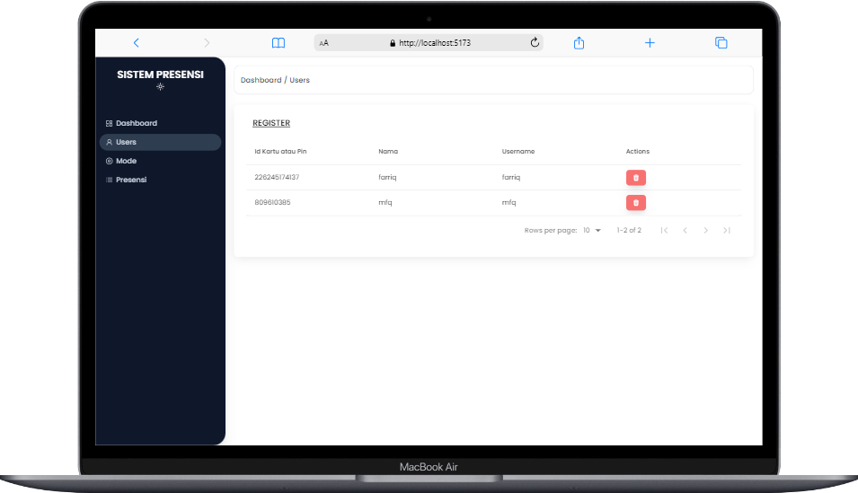
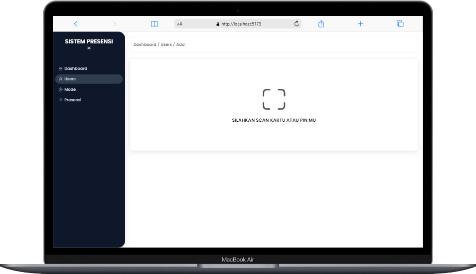
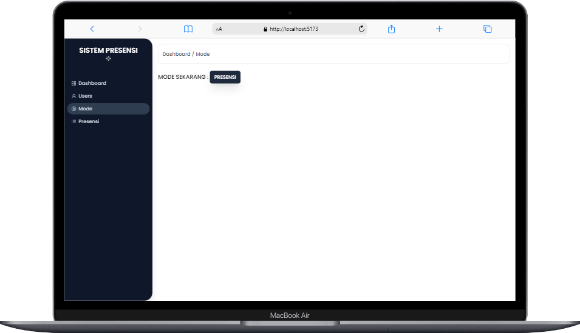
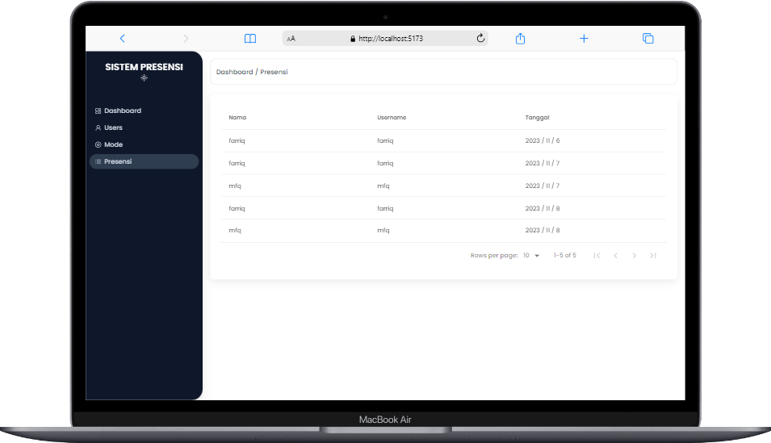

# Sistem Presensi
Project Sistem Presensi menggunakan Internet Of Think (esp32) dengan menggunakan modul RFID untuk scan kartu ataupun pin yang support RFID

## Tech stack
- React (Vite)
- Express js
- Prisma
- Socket IO

## Tools
- Visual Studio Code
- Arduino IDE

## Preview
###### DASHBOARD

###### USERS

###### USERS REGISTER

###### MODE

###### PRESENSI
